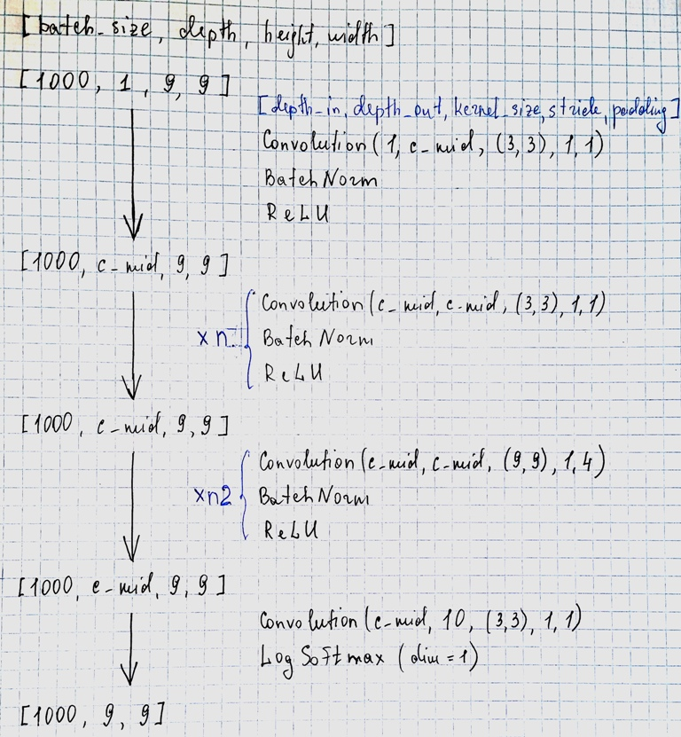
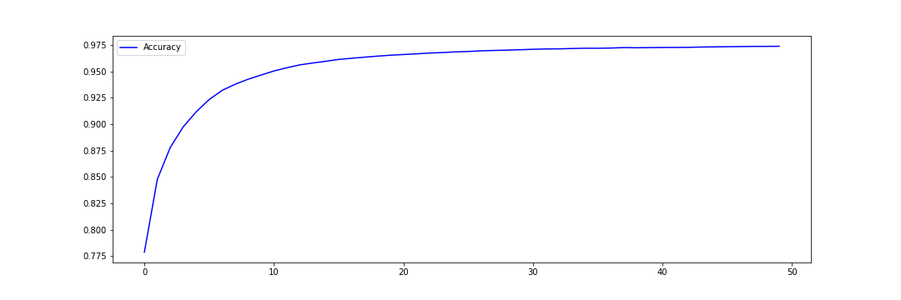

## Convolutional Neural Network for sudoku solving

### Architecture

The input for the model is 2d matrices of size 9x9 containing numbers from 1 to 9 and '0' for empty fields. Model consists of several Convolution layers mixed with Batch normalization and ReLU as shown in figure.

### Implementation

In the current implementation the following parameters are set:
~~~
n = 10
n2 = 0
c_mid = 100
~~~

Implementation can be found in file `Sudoku_train.ipynb`. Model was trained for 100 epochs on 900 000 sudokus and accuracy was calculated for 100 000 sudoku from `sudoku.zip`. As a result accuracy of 97,4 % was achived.

### Testing

Trained model was saved in `model_10_0_100.tar` and used to solve 30 sudokus from `sudoku_test.csv`. As a result accuracy of 76,9 % was achived. However https://github.com/GeorgeFENGP/Sudoku_Neural-Networks got 90,8 % accuracy on the same dataset.