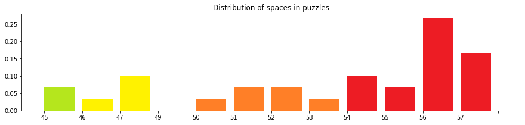

## Convolutional Neural Network for sudoku solving

Deep Convolution Neural Network model for solving sudoku puzzles with various number of givens.

## Table of contents
<!--ts-->
  * [Architecture](#architecture)
  * [Datasets](#datasets)
  * [Training](#training)
  * [Testing](#testing)
  * [Files](#files)
<!--te-->

### Architecture

The input for the model is 3d matrices of size *batch* x 9 x 9 containing numbers from 1 to 9 and '0' for empty fields. Model consists of Input Convolution layer with 3x3 kernel with Batch normalization and ReLU, several **Res2Net** layers and Output Convolution as shown in figure.

**Res2Net** is a modification of ResNet technique, which combines two convolutions with different kernel sizes (namely, 3x3 and 5x5) and residual connection as shown in figure.

### Datasets

One training and two testing datasets were used. For each dataset there is corresponding distribution of givens in puzzles.

1. Training dataset: 8.9 millions puzzles from https://www.kaggle.com/rohanrao/sudoku/ and https://www.kaggle.com/radcliffe/3-million-sudoku-puzzles-with-ratings

2. Testing dataset 1: 1 million puzzles from https://www.kaggle.com/bryanpark/sudoku

3. Testing dataset 2: 30 authentic puzzles from https://github.com/Kyubyong/sudoku & https://1sudoku.com/

### Training

Model was trainde for 10 epochs and final model is saved in `sudoku_res2net_model.tar`. The training curve for givens, blanks and overall accuracy is presented on figure.

### Testing
First of all, model was tested against 1 million sudoku dataset. The accuracy is extremely high (>0.999) due to the relativly low difficulty of puzzles (measured in number of givens). However, on the 30 authentic games accuracy is a bit lower than in development dataset. 

To boost the accuracy for hard cases, we use iterative approach. Given a prediction for a puzzle, algotrithm fills only one blank with the most certain prediction and repeats prediction for new puzzle. Thus, we achive much higher accuracy and outperform the solution from https://github.com/Kyubyong/sudoku as can be seen in figure.

### Files
This repo contains:
* `test.ipynb` — Jupyter Notebook with an example of solving sudoku with pretrained model
* `model.py` — source code for network training and solving
* `utils.py` — useful utils for data manipulation and vizualization
* `sudoku_res2net_model.tar` — pretrained model with hign accuracy
* `sudoku_test.csv` — file with 30 real-world sudoku quizes with solutions
* `Sudoku_train.ipynb` — deprecated Jupyter Notebook used for training before
* `img/` — folder with images for Readme
